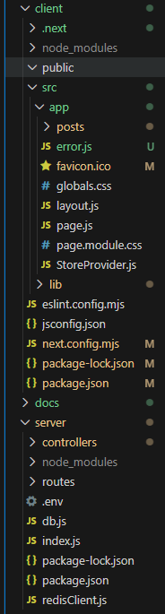
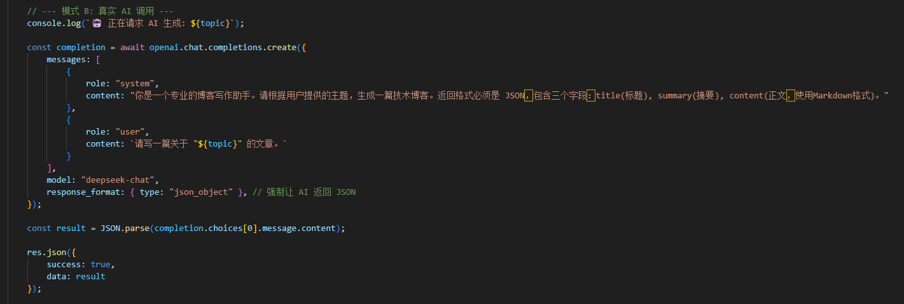
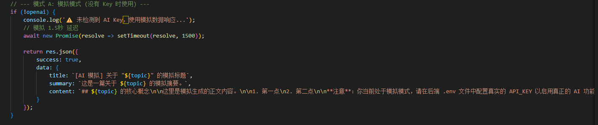
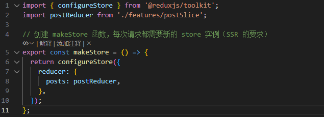
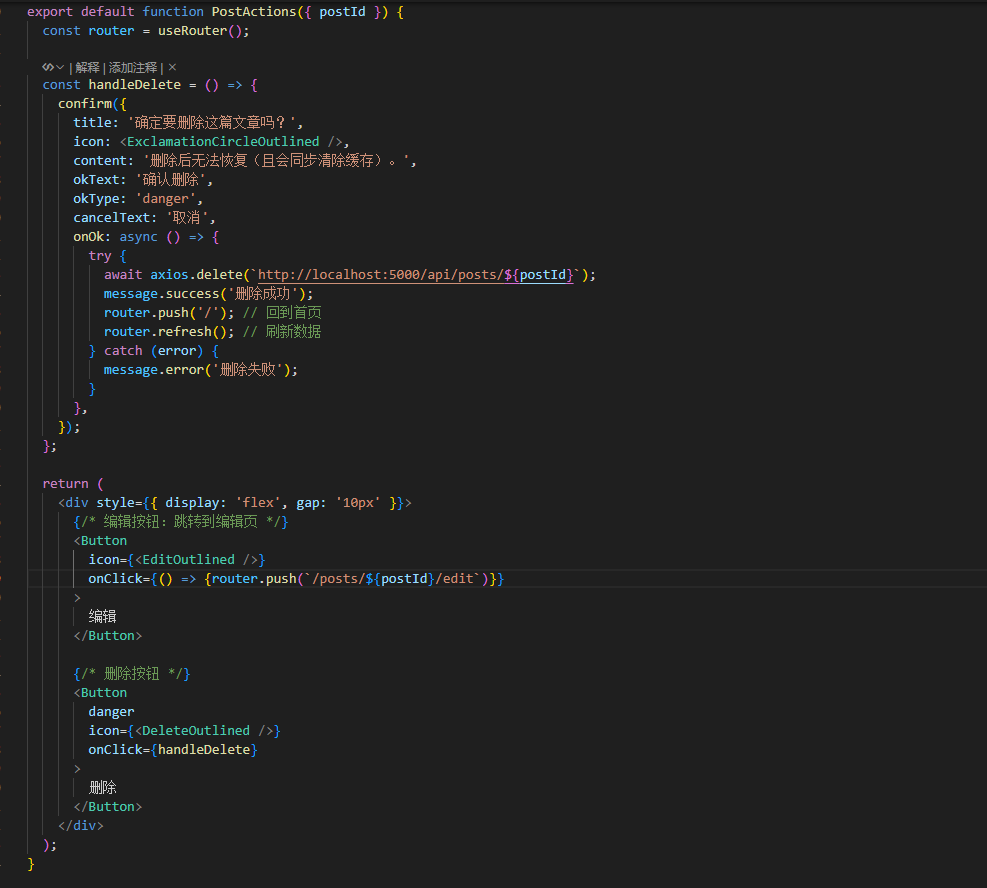
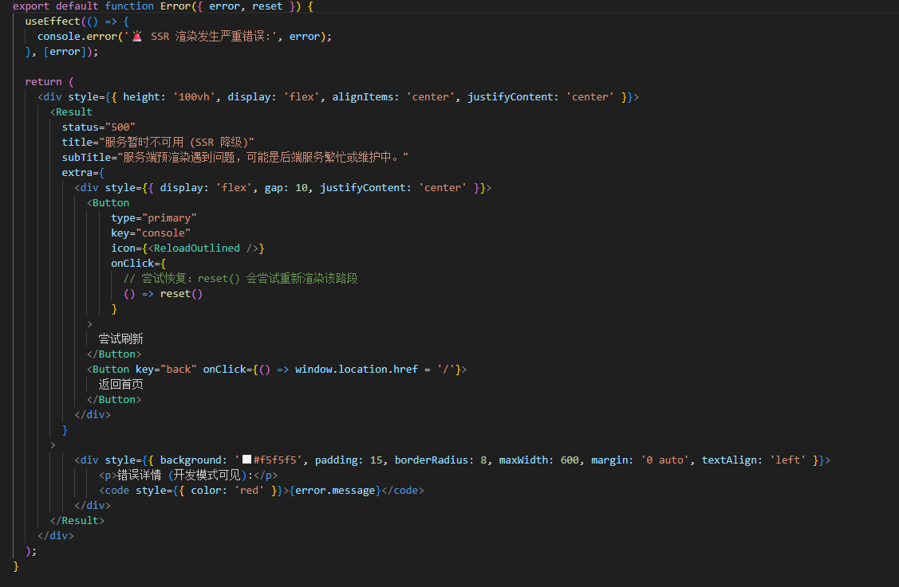
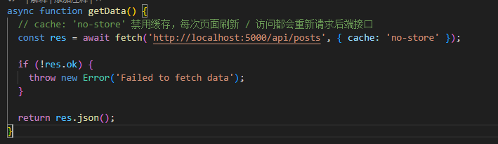

**React SSR 全栈博客系统**
基于 Next.js (SSR) + Express + MySQL + Redis 构建的高性能、现代化博客平台。集成 DeepSeek AI 写作助手，实现服务端降级与多级缓存策略。

**项目简介**
这是一个完全前后端分离，但通过 SSR 技术实现同构渲染的全栈项目。项目旨在解决传统 SPA（单页应用）在 SEO 和首屏加载速度上的痛点，同时引入 Redis 缓存解决高并发读取问题，并接入 DeepSeek 大模型实现智能化内容生产。

**技术栈**
__前端 (Client / SSR)__
核心框架: Next.js 14+ (App Router)

UI 组件库: Ant Design 5.x

状态管理: Redux Toolkit (React-Redux)

HTTP 客户端: Axios

CSS 方案: CSS Modules / AntD Style

__后端 (Server / API)__
运行时: Node.js

Web 框架: Express.js

数据库驱动: mysql2 (Promise based)

缓存驱动: Redis Client

AI SDK: OpenAI SDK (模拟实现)

数据存储
关系型数据库: MySQL 8.0+

内存数据库: Redis

📂 **项目目录结构**
Bash

react-ssr-blog/
├── client/                 # 前端项目 (Next.js)
│   ├── src/
│   │   ├── app/            # App Router 路由与页面
│   │   │   ├── error.js    # 服务端降级 UI
│   │   │   ├── layout.js   # 全局布局 & Redux 注入
│   │   │   ├── page.js     # 各种页面效果
│   │   │   └── posts/      # 文章相关路由
│   │   ├── lib/            # 工具库
│   │   │   ├── features/   # Redux Slices
│   │   │   └── store.js    # Redux Store 配置
│   │   └── ...
│   ├── next.config.mjs     #自定义静态资源缓存
│   └── package.json
│
├── server/                 # 后端项目 (Express)
│   ├── controllers/        # 业务逻辑层 (CRUD + AI)
│   ├── routes/             # 路由层
│   ├── db.js               # MySQL 连接池
│   ├── redisClient.js      # Redis 客户端
│   ├── index.js            # 入口文件
│   └── package.json

**架构设计与技术方案**
1. 服务端渲染 (SSR) 数据流
    为了兼顾 SEO 和用户体验，采用了 Next.js 的 Server Component 获取数据：

    用户请求页面。

    Next.js Server 直接发起 HTTP 请求调用 Express API。

    获取数据后，在服务端直接生成带有完整内容的 HTML。

    浏览器接收 HTML 并进行 Hydration (水合)，接管后续交互。

2. Redis 缓存策略 (Cache-Aside Pattern)
    为了减轻 MySQL 压力，实现了标准的旁路缓存模式：

    读策略：先查 Redis -> 命中返回；未命中查 MySQL -> 写入 Redis (TTL 1小时) -> 返回。

    写策略 ：当执行 UPDATE 或 DELETE 操作时，主动删除对应的 Redis Key (post:{id})，确保下次读取获取最新数据。

3. AI 写作助手集成
    前端通过 Modal 输入 Prompt。

    Express 后端通过 OpenAI SDK 调用 DeepSeek API。

    后端强制 System Prompt 返回 JSON 格式，前端接收后自动填充 AntD 表单。

    注：因deepseekApi无可用额度，还设计了一种模拟ai实现方式，即通过固定数据模拟生成文章内容。

**难点分析与解决方案**
__难点一：SSR 环境下的状态管理__
Redux Store 是单例的，在服务端渲染时，如果不处理好，会导致不同用户的请求共享同一个 Store，发生数据泄露。 解决：

在 client/src/lib/store.js 中导出一个 makeStore 函数而不是 store 实例。

每次请求（SSR）或组件初始化时，创建一个新的 Store 实例。

使用 StoreProvider (Client Component) 确保 Redux 只在客户端激活。

__难点二：修改，删除按钮布局__
利用自定义组件PostAction，在文章详情界面使用此组件
组件中定义编辑和删除逻辑

__难点三：服务端降级策略__
如果 Express 后端挂掉，Next.js 在服务端 fetch 数据会报错，导致整个页面白屏 (500 Error)。 解决：

利用 Next.js 的 Error Boundary 机制。

编写 app/error.js，当服务端组件抛出异常时，捕获错误并展示“服务暂时不可用”的降级 UI，提供“刷新重试”按钮，保证用户体验不中断。

__难点四：fetch 请求默认会开启缓存（默认策略是 cache: 'force-cache'）—— 即第一次请求接口后，结果会被缓存起来，后续页面访问会直接用缓存数据，不会再请求后端__
每次页面刷新、访问该请求时，都会重新向 http://localhost:5000/api/posts 后端接口发起请求，不会复用之前请求过的结果。

**启动前后端后**

访问 http://localhost:3000 即可看到效果。